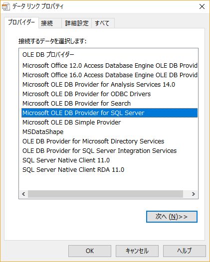

# DataLinkPropertiesDialogLib

Display `Data Link Properties` dialog (.NET Framework 2.0 and later):



## NuGet

```txt
PM> Install-Package DataLinkPropertiesDialogLib
```

## Usage

```cs
using DataLinkPropertiesDialogLib;

var newConnectionStringOrNull = DataLinkProperties.PromptNew();
```

```cs
using DataLinkPropertiesDialogLib;

var editedConnectionStringOrNull = DataLinkProperties.PromptEdit("Provider=MSDAOSP.1");
```
